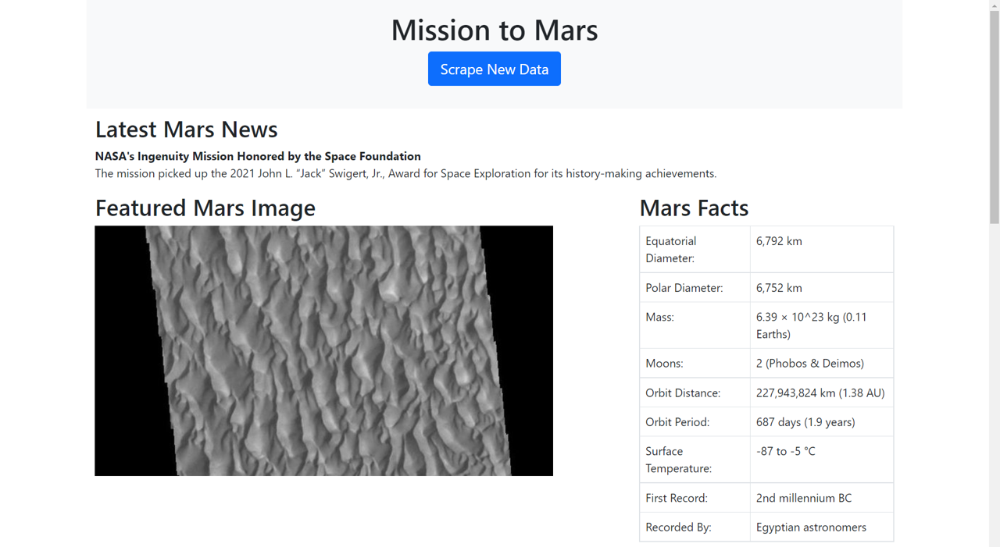
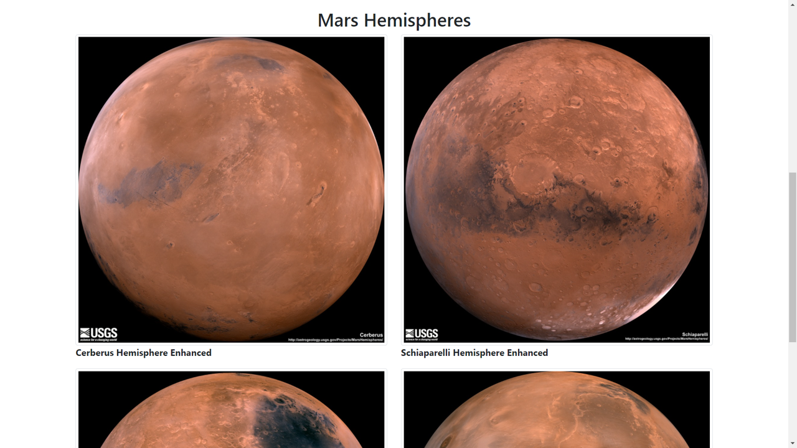

# Mission to Mars
This challenge entails scraping data about Mars from three different websites, adding that data to a database and creating a flask app to display this data in an html file. 

## Tools:
Jupyter Notebook 
Python 
MongoDB 
Flask 
HTML 

# Process 

1. Jupyter notebook was used to complete all web scraping and analysis tasks. See details in markdown on each step in the [mission_to_mars.ipynb](mission_to_mars.ipynb) included in this repository. Splinter was used to navigate the sites when needed and BeautifulSoup was used to help find and parse out the necessary data. 
2. MongoDB with Flask templating were used to create a new HTML page that displays all the information that was scraped from the various URLs. 
3. The Jupyter Notebook was converted into a Python script call [scrape_mars.py](scrape_mars.py) with a function called "scrape" that will execute the scraping code and return one Python dictionary containing all of the scraped data. 
3. I created a route called "/scrape" that will import [scrape_mars.py](scrape_mars.py) script and call the "scrape" function.
4. The return value was saved in a Mongo database. 
5. I created a root route "/" that will query the Mongo database and pass the scraped data into and HTML template to be displayed. 
6. The final HTML looks like this:

## Check it out yourself
1. Clone this repository to your computer. 
2. Use Visual Studio Code to open the repository on your computer.
3. Open [app.py](app.py) and run. Hold ctrl + click link in terminal to open the page. Click "Scrape New Data" button in web browser to collect most resent data on Mars. 

# Contact Information: 
### Hope Neely
Email: [hope.neely@gmail.com](hope.neely@gmail.com) 
LinkedIn: [https://www.linkedin.com/in/hopeneely/](https://www.linkedin.com/in/hopeneely/)